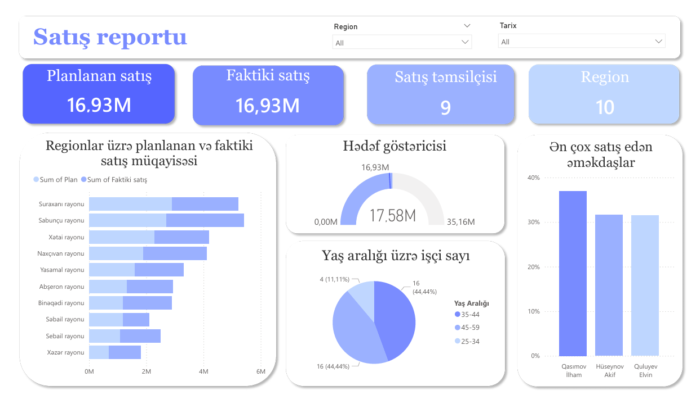

# 📊 Sales Analytics Report | Power BI

## 📌 Project Overview

This project is an interactive Sales Analytics Dashboard developed in Power BI to monitor sales performance, compare planned and actual sales, and analyze employee and regional performance through dynamic visualizations.

The dashboard enables business users to quickly identify top-performing regions, track sales targets, and gain valuable insights into workforce demographics.

---

## 🎯 Objectives

* Compare Planned Sales and Actual Sales
* Monitor regional sales performance
* Track sales target achievement
* Identify top-performing sales representatives
* Analyze employee distribution by age groups
* Support data-driven decision-making

---

## 📈 Report Features

### KPI Cards

* Planned Sales
* Actual Sales
* Number of Sales Representatives
* Number of Regions

### Regional Sales Analysis

Comparison of planned and actual sales across regions using bar charts.

### Target Achievement Indicator

Gauge visualization showing overall sales performance against target values.

### Top Sales Representatives

Ranking of employees based on sales performance.

### Employee Demographics

Age group analysis to understand workforce distribution.

### Interactive Filters

* Region Filter
* Date Filter

---

## 🛠️ Tools & Technologies

* Power BI Desktop
* DAX (Data Analysis Expressions)
* Power Query
* Data Modeling
* Interactive Visualizations

---

## 📊 Key DAX Calculations

### Employee Age Calculation

Calculated employee age based on date of birth.

### Age Group Classification

Employees categorized into age ranges:

* 18–24
* 25–34
* 35–44
* 45–59
* 60+

---

## 🚀 Business Value

This report helps organizations:

* Monitor sales performance in real time
* Compare targets with actual results
* Evaluate employee effectiveness
* Identify high-performing regions
* Improve strategic decision-making

---

### Skills

Power BI • DAX • SQL • Excel • Data Visualization • Business Intelligence
